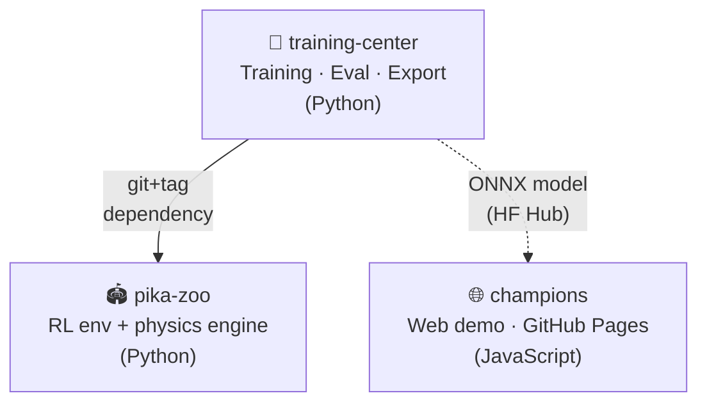

# alphachu-volleyball

> Train a Pikachu Volleyball AI with reinforcement learning and play against it in your browser

A project to train a reinforcement learning agent based on reverse-engineered Pikachu Volleyball (1997) and play against it in the browser.

## Repositories

| Repo | Description | Status |
|------|-------------|--------|
| [pika-zoo](https://github.com/alphachu-volleyball/pika-zoo) | Pikachu Volleyball physics engine Python port + PettingZoo/Gymnasium RL environment | 🟢 Active |
| [training-center](https://github.com/alphachu-volleyball/training-center) | RL training pipeline (Crossplay, Curriculum, ONNX export, HF Hub) | 🟢 Active |
| [champions](https://github.com/alphachu-volleyball/champions) | Web demo — play against alphachu in the browser (GitHub Pages) | 🟢 Active |

## Architecture

## Related Projects

- [gorisanson/pikachu-volleyball](https://github.com/gorisanson/pikachu-volleyball) — Reverse-engineered JS reimplementation of the original
- [helpingstar/pika-zoo](https://github.com/helpingstar/pika-zoo) — Pikachu Volleyball PettingZoo environment (reference)
- [hankluo6/Pikachu-VolleyBall-RL](https://github.com/hankluo6/Pikachu-VolleyBall-RL) — Prior research on PPO/ES
- [DuckLL/pikachu-volleyball](https://github.com/duckll/pikachu-volleyball) — Rule-based Super AI