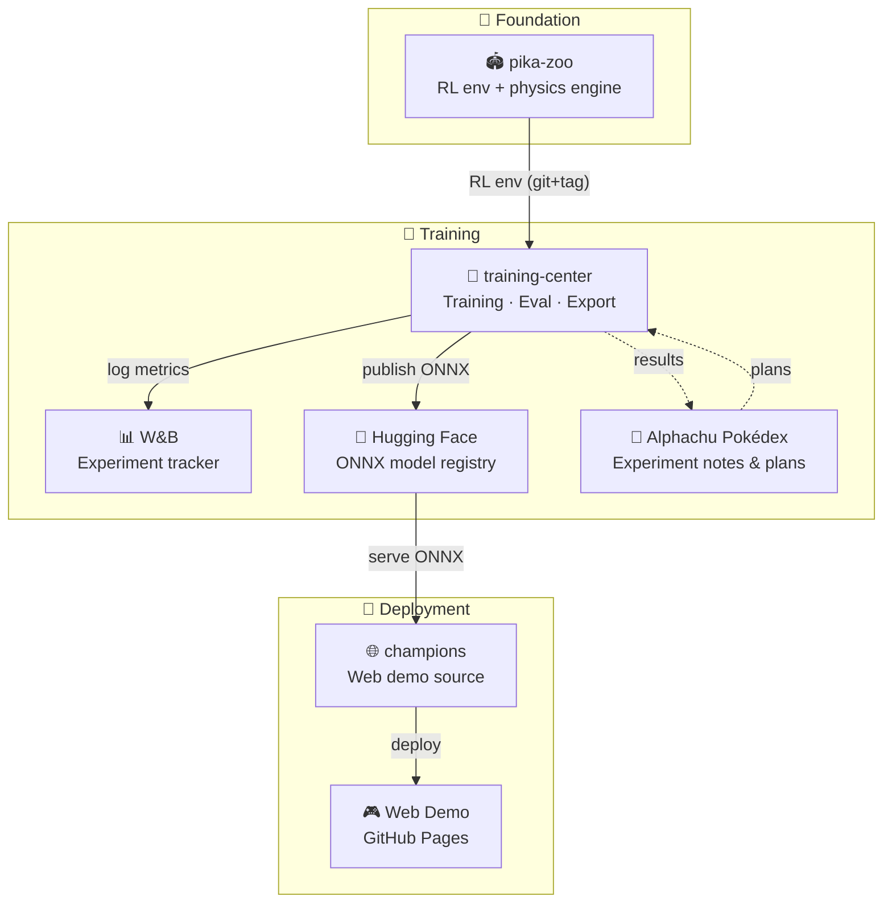

# alphachu-volleyball

> Train a Pikachu Volleyball AI with reinforcement learning — play against it or watch AI vs AI matches, right in your browser

A project to train reinforcement learning agents on reverse-engineered Pikachu Volleyball (1997). Play against them or spectate AI vs AI showdowns directly in the browser.

## Architecture

## Resources

| Category | Name | Description |
|----------|------|-------------|
| 📦 Repo | [pika-zoo](https://github.com/alphachu-volleyball/pika-zoo) | Pikachu Volleyball physics engine Python port + PettingZoo/Gymnasium RL environment |
| 📦 Repo | [training-center](https://github.com/alphachu-volleyball/training-center) | RL training pipeline (Crossplay, Curriculum, ONNX export, HF Hub) |
| 📦 Repo | [champions](https://github.com/alphachu-volleyball/champions) | Web demo — play or watch AI vs AI matches in the browser (GitHub Pages) |
| 🌐 Link | [Web Demo](https://alphachu-volleyball.github.io/champions/) | Play against alphachu or watch AI vs AI matches in your browser |
| 🌐 Link | [Alphachu Pokédex](https://github.com/orgs/alphachu-volleyball/projects/1) | Experiment notes and plans |
| 🌐 Link | [Hugging Face](https://huggingface.co/alphachu-volleyball) | Trained model deployments (ONNX) |
| 🌐 Link | [W&B](https://wandb.ai/ootzk/alphachu-volleyball) | Experiment tracker (metrics, reward curves, ELO) |
| 📚 Reference | [gorisanson/pikachu-volleyball](https://github.com/gorisanson/pikachu-volleyball) | JS reimplementation; game engine base |
| 📚 Reference | [helpingstar/pika-zoo](https://github.com/helpingstar/pika-zoo) | RL env; obs/action interface base |
| 📚 Reference | [hankluo6/Pikachu-VolleyBall-RL](https://github.com/hankluo6/Pikachu-VolleyBall-RL) | PPO/ES research; RL approach inspiration |
| 📚 Reference | [DuckLL/pikachu-volleyball](https://github.com/duckll/pikachu-volleyball) | Rule-based AI; training opponent |