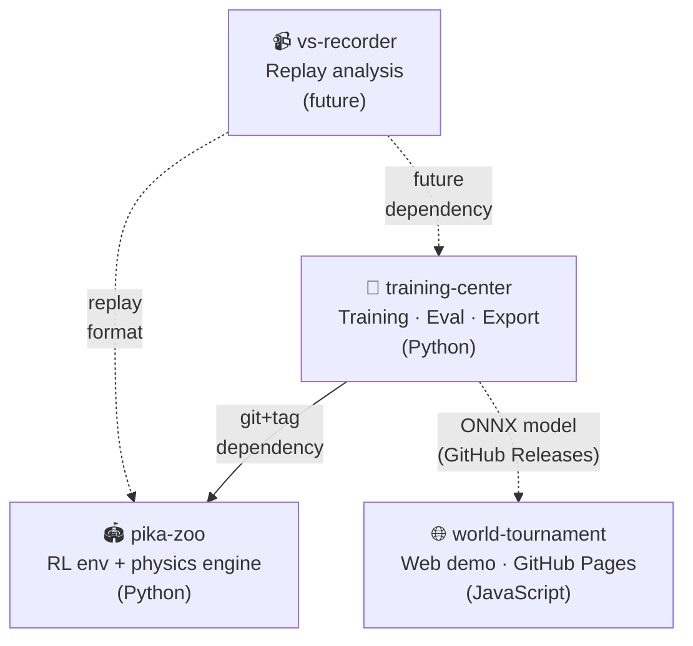

# alphachu-volleyball

> Train a Pikachu Volleyball AI with reinforcement learning and play against it in your browser

피카츄배구(1997) 리버스 엔지니어링 기반의 강화학습 에이전트를 훈련하고, 브라우저에서 직접 대전할 수 있는 프로젝트.

## Repositories

| Repo | 설명 | 상태 |
|------|------|------|
| [pika-zoo](https://github.com/alphachu-volleyball/pika-zoo) | 피카츄배구 물리엔진 Python 포팅 + PettingZoo/Gymnasium RL 환경 | 🟡 개발 중 |
| [training-center](https://github.com/alphachu-volleyball/training-center) | 강화학습 실험 파이프라인 (PPO, Self-play, PFSP) | 🟡 개발 중 |
| [world-tournament](https://github.com/alphachu-volleyball/world-tournament) | 웹 데모 — 브라우저에서 alphachu와 대전 (GitHub Pages) | ⚪ 예정 |
| [vs-recorder](https://github.com/alphachu-volleyball/vs-recorder) | 리플레이 분석 및 기술 시각화 도구 | ⚪ 추후 |

## Architecture

## 관련 프로젝트

- [gorisanson/pikachu-volleyball](https://github.com/gorisanson/pikachu-volleyball) — 원작 리버스 엔지니어링 JS 재구현
- [helpingstar/pika-zoo](https://github.com/helpingstar/pika-zoo) — 피카츄배구 PettingZoo 환경 (참고)
- [hankluo6/Pikachu-VolleyBall-RL](https://github.com/hankluo6/Pikachu-VolleyBall-RL) — PPO/ES 선행 연구
- [DuckLL/pikachu-volleyball](https://github.com/duckll/pikachu-volleyball) — 규칙 기반 Super AI